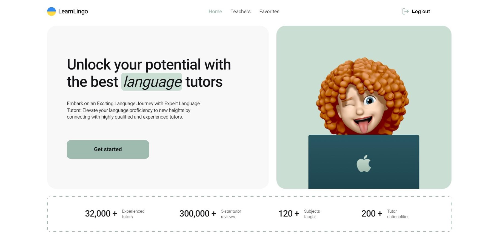

# LearnLingo

The application for a company that offers the services of language tutors for
online language learning.

## Features

- Fetching data about teachers from Firebase
- Filter teachers based on various criteria (languages, levels, price)
- Save selected teachers as favorites
- Enable pagination for browsing through the teachers list

## Technologies used:

- React.js
- Redux Toolkit
- Styled Components
- Firebase

## Live page

The live page can be accessed through the following link:
https://olena-rudnieva.github.io/LearnLingo/

## Test Task

Create an application for a company that offers the services of online language
tutors. The application consists of three pages:

Home Page: This page displays the company's advantages and includes a link
encouraging users to start using the application. Clicking the link redirects
users to the "Teachers" page.

Teachers Page: This page contains a list of tutors that users can filter by
teaching language, student proficiency levels, and hourly lesson prices.

Favorites Page: This private page displays tutors that the user has added to
their favorites.

## Technical Specifications:

- Use Firebase_DB to enable authentication (registration, login, fetching
  current user data, logout).
- Implement a registration/login form and minimal validation using Formik & Yup.
  All fields must be mandatory. The modal window with the form should close by
  clicking the "x" button, clicking on the backdrop, or pressing the Esc key.
- In the Realtime Database (Firebase), create a collection of teachers.
- Implement a card with the teacher's characteristics according to the layout.
- Render four teacher cards on the "Teachers" page, and load more cards upon
  clicking the "Load more" button, triggering a database query for additional
  cards.
- If an unauthorized user clicks the heart-shaped button, show a modal window or
  push notification stating that this feature is available only for authorized
  users. For authorized users, add the card to the favorites list (using
  localStorage or Firebase's user collection) and change the heart button color.
- Upon a second click on the heart-shaped button, remove the card from the
  favorites list and revert the button color to its initial state.
- Clicking the "Read more" button should expand the card with more detailed
  information about the teacher and reviews from students.
- Clicking the "Book trial lesson" button should open a modal window with a form
  for booking a trial lesson. Implement form validation using Formik & Yup. All
  fields must be mandatory.
- The modal window should close by clicking the "x" button, clicking on the
  backdrop, or pressing the Esc key.
- For an authorized user, provide access to the private "Favorites" page, where
  the user can view all cards of teachers they have added to their favorites.
  The styling of this page should be similar to the "Teachers" page.
